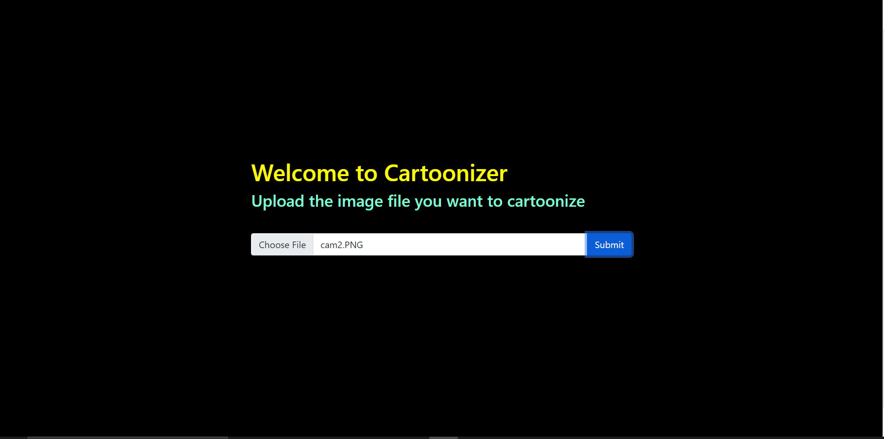
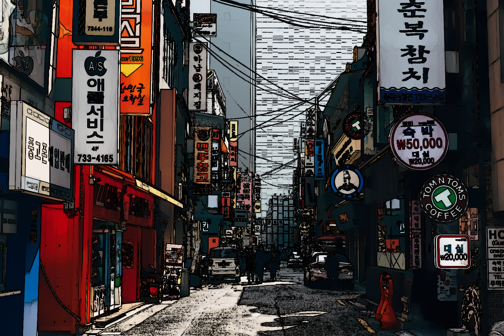

# Cartoonizer

### Overview
This website uses opencv to cartoonize any image uploaded.
Stack Used
1. Flask
2. OpenCV
3. HTML/CSS

### Live Link
https://cartoonizerr.herokuapp.com

### Novelty
1. 

### Screenshots

#### Screen

#### Before

#### After

